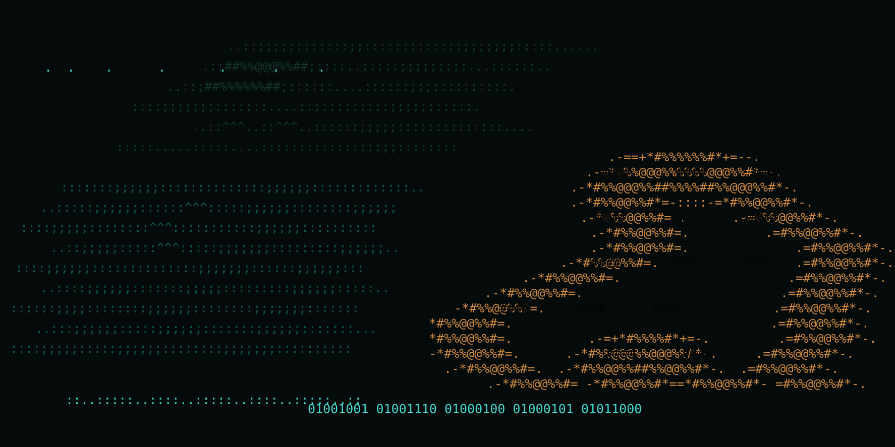

# Akamata



[日本語](README.ja.md) | English

A minimal web framework for Zig 0.16. Akamata builds its HTTP and WebSocket
layers around Zig and its standard library, provides SQLite, D1, and Turso
database backends, and targets native servers, Cloudflare Workers, and
Cloudflare Containers.

Latest release: **v0.0.1** · Requires **Zig 0.16.x** · [Release notes](CHANGELOG.md)

```zig
const std = @import("std");
const am = @import("akamata");

const State = struct {};

fn hello(c: *am.Context(State)) !void {
    try c.text("Hello, Akamata!");
}

pub fn main() !void {
    var gpa: std.heap.DebugAllocator(.{}) = .init;
    defer _ = gpa.deinit();
    var app = am.App(State).init(gpa.allocator(), .{});
    defer app.deinit();
    _ = try app.get("/", hello);
    try app.serve(.{ .port = 8080 });
}
```

## Why Akamata?

- **One codebase, multiple runtimes** — share handlers between native servers,
  Workers, and Containers; runtime entry points remain explicit.
- **Unified database API** — use the same `Db`/`Stmt` and model repository APIs
  with local SQLite, Cloudflare D1, or Turso.
- **Zig-native developer experience** — typed `App(State)`, `Context(State)`,
  input validation, middleware, model schemas, and repositories.
- **Production observability** — request, DB, outbound HTTP, and custom span
  timing through Prometheus metrics, structured logs, and `Server-Timing`.

## Quick start

The CLI installer is included in the repository; clone it first:

```bash
git clone https://github.com/appleuser634/Akamata.git
cd Akamata
./scripts/install.sh

# Ensure $HOME/.local/bin is on PATH, then create an app anywhere.
cd ~/projects
akamata init myapp --target=both
cd myapp
zig build run
```

In another terminal:

```bash
curl -sS http://127.0.0.1:8080/
curl -sS http://127.0.0.1:8080/notes
```

The generated project includes a validated `Note` model, SQLite auto-migration,
CRUD routes under `/notes`, a health route, a Workers entry point, Wrangler
configuration, an empty versioned-migration directory, Workers JS glue, and a Container Dockerfile. See the
[Quick Start](docs/en/quickstart.md) for the exact tree and responses.

Developing the CLI itself? Build without installing:

```bash
zig build cli
./zig-out/bin/akamata help
```

## Requirements and compatibility

| Scope | Requirement |
|---|---|
| Core development | Zig 0.16.x, macOS or Linux, libc |
| Native database | Bundled SQLite amalgamation; no system SQLite install required |
| Workers | Node.js + Wrangler, a Cloudflare account; D1 is optional |
| Containers | Docker; Cloudflare Containers requires an eligible Cloudflare plan |
| Turso / HTTPS client | Zig standard-library TLS and the OS trust store |
| FCM RS256 signing only | Optional OpenSSL build flag (`-Dopenssl=true`) |

Windows native support is not documented or tested; use WSL2 for the supported
Linux workflow. SSE and native WebSocket connections are native-only today;
Workers WebSockets use the provided Workers/Durable Object integration pattern.

## Documentation

| Goal | English | 日本語 |
|---|---|---|
| Get running | [Quick Start](docs/en/quickstart.md) | [クイックスタート](docs/ja/quickstart.md) |
| Learn step by step | [Tutorial](docs/en/tutorial.md) | [チュートリアル](docs/ja/tutorial.md) |
| Tour the framework | [Handbook](docs/en/handbook.md) | [ハンドブック](docs/ja/handbook.md) |
| Find a topic | [Documentation home](docs/en/README.md) | [ドキュメントホーム](docs/ja/README.md) |
| Present Akamata | [Slides (PDF)](docs/en/slides.pdf) | [スライド (PDF)](docs/ja/slides.pdf) |

## Features

- Runtime route builder, path parameters, grouped routes, and middleware
- JSON, form, multipart, cookies, validation, and typed model repositories
- SQLite, D1 through JSPI, and Turso/libsql Hrana
- Native WebSocket, SSE, static files, compression, and security middleware
- JWT, bcrypt, sessions, CSRF, rate limiting, and bearer authentication
- Native/Workers outbound HTTP, MQTT QoS 0, and optional FCM support
- Request IDs, access logs, Prometheus metrics, lightweight spans, and
  `Server-Timing`
- OpenAPI generation, typed client generation, testing client, jobs, and cron

Backend availability and API details are documented in the
[Handler API](docs/en/handler-api.md), [DB backends](docs/en/db-backends.md),
and [WebSocket guide](docs/en/websocket.md).

## Examples

- [`examples/chat/`](examples/chat/) — REST + native WebSocket chat with SQLite
- [`examples/guestbook/`](examples/guestbook/) — model/repository guestbook for
  SQLite, D1, and Turso
- [`examples/tasks/`](examples/tasks/) — reference REST API covering validation,
  OpenAPI, SSE, sessions, security middleware, jobs, and testing
- [`examples/mobus/`](examples/mobus/) — a larger real-world application port
- [`examples/bench/`](examples/bench/) — reproducible framework benchmarks

## License

MIT
